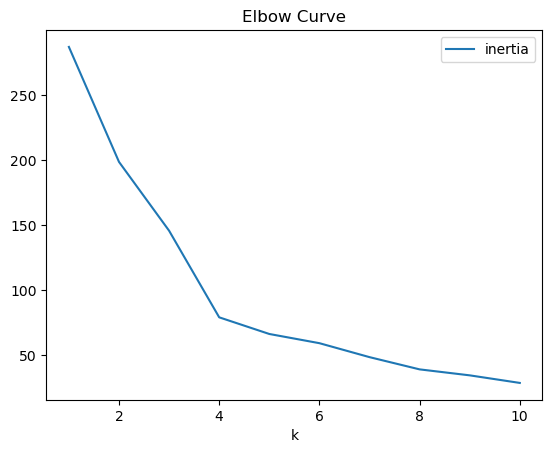
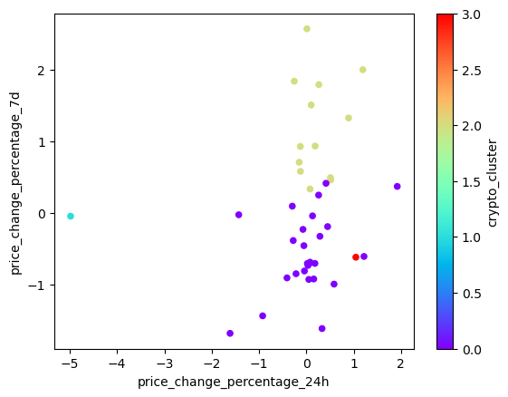
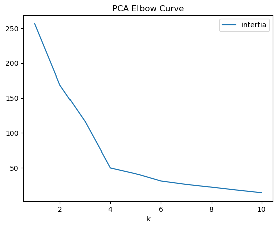
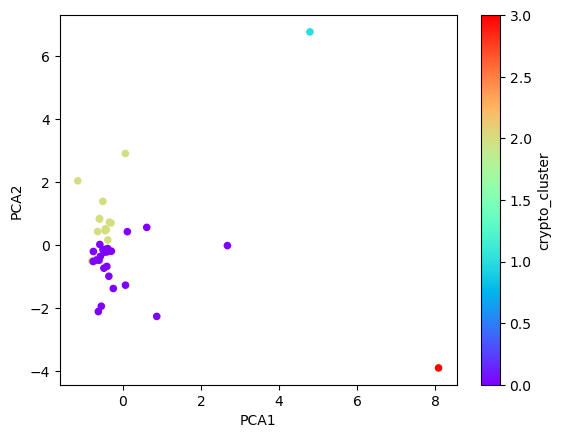

# CryptoClustering - module 11 AI bootcamp

In this Challenge, you’ll apply your understanding of the K-means algorithm and principal component analysis (PCA) to classify cryptocurrencies according to their price fluctuations across various timeframes. Specifically, you will examine price changes over intervals spanning 24 hours, 7 days, 30 days, 60 days, 200 days, and 1 year

## Find the Best Value for k Using the Original Scaled DataFrame.

**Question:** What is the best value for `k`?

* **Answer:** Based on our Elbow chart effort it shows the best value for 'k' is 4

## Cluster Cryptocurrencies with K-means Using the Original Scaled Data.

## Optimize Clusters with Principal Component Analysis.

**Question:** What is the total explained variance of the three principal components?

* **Answer:** Summed explained variance(rounded to 3 decimal places): 0.895

## Find the Best Value for k Using the PCA Data

* **Question:** What is the best value for `k` when using the PCA data?

  * **Answer:** Based on this Elbow curve it shows 4 is the best value for 'k'

* **Question:** Does it differ from the best k value found using the original data?

  * **Answer:** It does not differ between original dataset and the PCA data

## Cluster Cryptocurrencies with K-means Using the PCA Data
  

## Determine the Weights of Each Feature on each Principal Component

**Question:** Which features have the strongest positive or negative influence on each component? 
 
* **Answer:** analysis provides the following information for strongest positive influence for each component: 
            PCA1: Feature price_change_percentage_200d (0.594468)
            PCA2: Feature price_change_percentage_30d (0.562182)
            PCA3: Feature price_change_percentage_7d (0.787670)